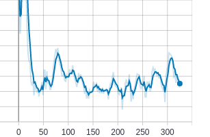
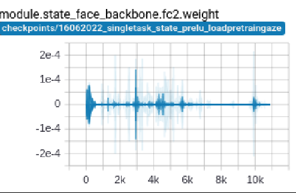
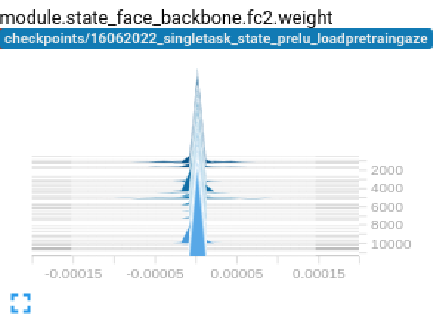
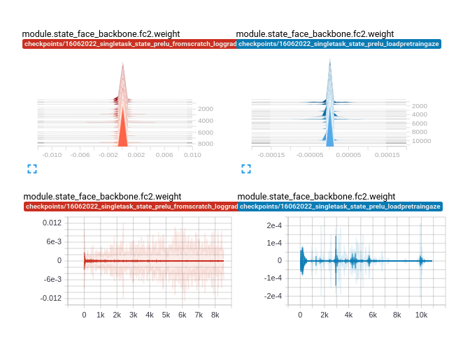

### 1. Introduction
We all know that there are 2 main problems when training deep learning model which are overfitting and underfitting problems. Each problem have different solutions to tackle. e.g
+ With overfitting: Add more data, data augmentation, reduce complexity of model,etc
+ With underfitting: Using bigger model, double-check some bugs (e.g input's unnormalized, bug in loss function causing Nan value, etc)

### 2. My case
At the beginning of my project, I train the eyegaze model and got the underfitting problem, the training loss looked like the image below. 




**Let's together debug it**.

Firstly, I check the above-mentioned solutions:
- Using bigger model. From mobilev2 --> resnet50
- Check if input image is normalized. Yes it is normalized. 
- Loss function I used was **l2**, and it was obvious that the loss values are the _normal_ float number, there is no Nan value here.
    $$ lossgaze = \sqrt(pred - gt)^2 $$

Sadly, it did not fix the issue. So..., what to do next? I thought there may be **inconsitence** or **corruption in the dataset** like wrong labels or stuff like that, which might lead to model confusing and difficult to learn. 

Yeah it might be, then I decided to use a very small subdet of dataset (around only 100 samples), which I manually double-checked the quality, for training to see whether the model can even overfit it or not.  _This technique is mentioned on the training model recipe of Karpathy [overfit one batch](http://karpathy.github.io/2019/04/25/recipe/)_.

Unfortunately, It still does not work, the training loss did not even decrease! So..., what next? Uptil now, it seems there is nothing wrong with the _forward pass_ from data, label and loss function. What if there is any wrong with the _backward pass_ , which actually is **gradient**. Yeah, let's check it.  Below is snippet of code to log gradient and weight of any params using _Tensorboard_

```python

from torch.utils.tensorboard import SummaryWriter
import numpy as np
import torch

class TensorBoardLogger():
    def __init__(self, root="./", experiment_name="experiment1"):
        self.root = root
        self.experiment_name = experiment_name
        self.writer = SummaryWriter(f'{root}/{experiment_name}')
    
    def log(self, metric="loss", value=0.0, step=0):
        self.writer.add_scalar(metric, value, step)
    
    def log_hist(self, tag="gradient_1", value=0.0, step=0):
        self.writer.add_histogram(tag, value, step)

def track_model_gradients(model, tensorboardLogger, step):
    for i, (tag, parm) in enumerate(model.named_parameters()):
        if hasattr(parm, 'grad'):
            tensorboardLogger.log_hist(tag=f"gradient_{tag}", value=parm.grad.data.cpu().numpy(), step=step)
        if hasattr(parm, 'data'):
            tensorboardLogger.log_hist(tag=f"weight_{tag}", value=parm.data.cpu().numpy(), step=step)

```





Surprisingly, the _weight_ of _fc2_ layer of the model  ~ **0**, which lead to __gradient__ approximately **0** too. When _fc2's gradient_ is 0, then all the gradient of earlier layers will be 0 too due to the chain rule when do backpropagation. 

Finally, we found the reason lead to underfitting in my case is that **the weights of layers are not well-intialized causing all gradients become 0**.

### 3. Solution
The sollution is really simple. Init the weights more carefully (.i.e avoid theirs values ~ 0). Below is the snippet of code I used.

```python
def initialize_weights(m):
    if isinstance(m, nn.Conv2d):
        nn.init.kaiming_uniform_(m.weight.data,nonlinearity='relu')
        if m.bias is not None:
            nn.init.constant_(m.bias.data, 0)
    elif isinstance(m, nn.BatchNorm2d):
        nn.init.constant_(m.weight.data, 1)
        nn.init.constant_(m.bias.data, 0)
    elif isinstance(m, nn.Linear):
        nn.init.kaiming_uniform_(m.weight.data)
        nn.init.constant_(m.bias.data, 0)
```


- The weights are initialized well (the left side) vs not well (the right side) 


- When weights are initialized well, then loss starting to converge.
    


