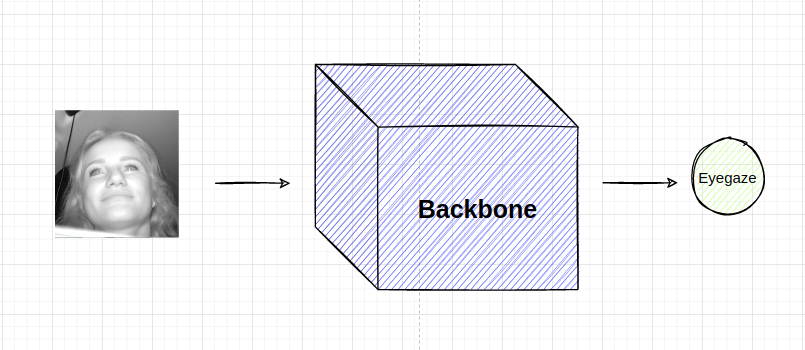

### 1. Introduce eyegaze model
- Basically, eyegaze is the eye direction which can be used to indicate where the people are look at. e.g The red vectors in the image below are the eyegazes of people

- Specifically in the Driver Monitor System, the eyegaze will help us to determine whether the driver’s eyes still focus on the road or not, if it’s not, then the system will make a distraction warning for the driver

- Speaking of deep learning model design, the simplest  model will take the face of driver as the input —> backbone —> prediction

### 2. WHY need uncertainty estimation in production?

Let’s come back to Driver Monitor System.

In production, there are many cases that we’ve not anticipated yet.

- **Case 1**: The data might be very different from the train data. e.g The train data will be of Asian people with yellow skin, short hair but the real-world data will be of African, American with long hair and mustache and long eyelashes, etc
    
    At that time, **the model might perform much worse, how do we detect those cases?**

    If we are able to detect it, we will collect data in those cases, label and add to the training dataset. It will help the model improve day by day. The more edges cases it detected, the more chance model will be improve. It is really cool, isn’t it?

- **Case 2**: The camera is broken somehow make the quality image become too bad or the drivers’s eyes are occluded by eyeglasses, etc , infinite situations. In such situations, we want the model saying something like **“Ohhh, there are something wrong with the input image, It looks so weird, I’ve not ever seen something like that so I am not quite sure about my prediction. So I think you can not use my prediction to saying the driver is distraction”.**
    
    **How can the model do that?** If there is, it is really cool, right?

Therefore, if the model can estimate the uncertainty of its predictions. It will help us improve the model performance (like Case 1) and  robustness of the system (like Case 2)

### 3. HOW to estimate uncertainty of model prediction?
- Firstly, in term of model design, we basically just add a new node which is the **uncertainty node**

- Secondly, which is more important. How to train the uncertainty node? Do we need the label to supervise?… Interestingly, the answer is No. We don’t need any more labels to supervise for the uncertainty node. The model can learn uncertainty itself if we add uncertainty to the right place in the loss function. Ok. so the magic is in the loss function. Let’s jump right to it: 
    Loss function:
    - The vanilla loss function for regression problem as we know is MSE. In general cases, it usually work really well, that is why we usually using it. 
    
    - To handle the **uncertainty**, we basically just add the variance term as the denominator like

        

        How it make sense? How the model can optimize that loss so that the variance term is the uncertainty that we want. Intuitively, let’s consider 2 cases:
        -   First case, when the input image to the model is easy (.i.e clear, high quality, no occlusion,  etc), then the *numerator term* tend to be small causing the overall loss is small.

        -   Second case, when the input image to the model is hard (.i.e blur, occlusion, etc), then the numerator term tend to be big, then in order to get the small overall loss, the *denominator* should be optimized to the larger number == high uncertainty. It is exactly what we want “*When the model get hard images, it should return high uncertainty*”, right?

        In conclusion, the vanilla MSE loss can only capture the mean value, which is the blue sine curve in the image below. In other hand, the proposed loss will capture both mean value and the uncertainty which is the blue shadow area in the image below. It help us know how confidence the model is about their prediction

        

        **If you want to dig deeper into that**, I highly recommend you to read through references below.
        - [Probabilistic Deep Learning Book](https://livebook.manning.com/book/probabilistic-deep-learning-with-python/chapter-4/157). This book talks about deep learning in the probabilistic perspective. In chapter 4, it explain very clearly about how *uncertainty node* is optimized without any label for it.
        - [What Uncertainties Do We Need in Bayesian Deep Learning for Computer Vision?](https://arxiv.org/abs/1703.04977) **.**
            This paper give a good overall about different kind of uncertainty. In session 3, they also explain about the loss function used to estimate the uncertainty of the prediction. 
        - [Weakly-Supervised Physically Unconstrained Gaze Estimation](https://arxiv.org/pdf/2105.09803.pdf). Session *Aleatoric Gaze Loss*

### 4. Demostration
I trained the model with the proposed loss function, and it worked as expected.
In the demostration video below, I try to act some scenarios that might happen in production. **Please the image right below to see the video**

- When the eye are clear, then the gaze variance is small (around 0.05)
    
- When the eye are occluded, then the gaze variance is bigger (around 0.25)
    

### 5. How to convert uncertainty number to confidence score which range from 0-100%
The uncertainty returned from the model is numbers like 0.05, 0.10, 0.25, etc, which is not intuitive to understand.
So, it is neccessary to convert those uncertainty values to confidence value ranging from 0-100%.

**Coming soon...**

